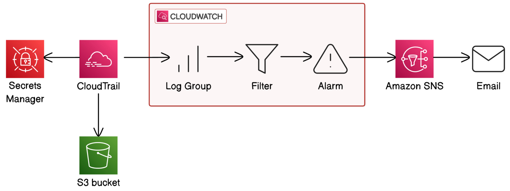

# AWS Secret Access Monitoring with Terraform

This project provisions a small AWS security monitoring system that detects when a monitored AWS Secrets Manager secret is accessed. It uses Terraform to create the secret, enable CloudTrail logging, forward CloudTrail events to CloudWatch Logs, extract matching secret access events into a CloudWatch metric, and send an SNS email alert through a CloudWatch alarm.

The project is designed as a hands-on security engineering lab. It is intentionally split into small Terraform modules so each part can be deployed, tested, committed, and reviewed independently.

## What This Builds

- An AWS Secrets Manager secret used as the monitored sensitive resource.
- A single-region CloudTrail trail that records AWS management events.
- An S3 bucket for CloudTrail log file delivery.
- A CloudWatch Logs group that receives CloudTrail events.
- A CloudWatch Logs metric filter that matches `GetSecretValue` calls for the monitored secret.
- A CloudWatch alarm that enters `ALARM` when the secret is accessed.
- An SNS topic and email subscription for alert delivery.

## Architecture


## Repository Structure

```text
.
|-- main.tf
|-- outputs.tf
|-- providers.tf
|-- variables.tf
|-- versions.tf
|-- terraform.tfvars.example
`-- modules
    |-- alerting
    |-- cloudtrail
    |-- cloudwatch_filter
    `-- secret
```

Module responsibilities:

- `modules/secret`: creates the monitored Secrets Manager secret and initial secret version.
- `modules/cloudtrail`: creates CloudTrail, the CloudWatch Logs group, S3 log bucket, and IAM permissions needed for log delivery.
- `modules/cloudwatch_filter`: creates the metric filter and metric transformation for `GetSecretValue` events.
- `modules/alerting`: creates the SNS topic, email subscription, topic policy, and CloudWatch alarm.

## Prerequisites

- Terraform `>= 1.11`.
- AWS CLI configured for the target account.
- AWS permissions to create Secrets Manager, CloudTrail, CloudWatch Logs, CloudWatch alarms, SNS, S3, and IAM resources.
- An email address that can confirm an SNS subscription.

Check your AWS identity before deploying:

```sh
aws sts get-caller-identity
```

## Configuration

Create a local Terraform variables file:

```sh
cp terraform.tfvars.example terraform.tfvars
```

Edit `terraform.tfvars`:

```hcl
aws_region   = "ap-southeast-1"
project_name = "secret-monitoring"

alert_email = "you@example.com"

secret_name           = "secret-monitoring/demo-secret"
secret_string         = "replace-with-a-lab-only-secret-value"
secret_string_version = 1

secret_recovery_window_in_days = 0

cloudwatch_log_retention_days = 30
s3_log_retention_days         = 90
```

Important security notes:

- Do not commit `terraform.tfvars`.
- `terraform.tfvars` is ignored by git.
- Use a lab-only secret value for this project.
- The secret value is passed through the Terraform AWS provider using the write-only `secret_string_wo` argument, so supported provider versions do not store the secret string directly in Terraform state.
- If you change `secret_string`, increment `secret_string_version`.

## Deploy

Initialize Terraform:

```sh
terraform init
```

Check formatting and validate the configuration:

```sh
terraform fmt -check -recursive
terraform validate
```

Review and apply the plan:

```sh
terraform plan
terraform apply
```

After apply, open the SNS confirmation email and confirm the subscription. The CloudWatch alarm can execute its SNS action before confirmation, but email delivery only works after the subscription is confirmed.

## Step-by-Step Lab Flow

The infrastructure was designed to be built in small slices:

1. Create the Secrets Manager secret.
2. Enable CloudTrail logging.
3. Read the secret and confirm CloudTrail records `GetSecretValue`.
4. Add the CloudWatch Logs metric filter.
5. Add the CloudWatch alarm and SNS email alert.
6. Run an end-to-end test and troubleshoot delivery delays.

You can still deploy the full stack in one `terraform apply`, but the step-by-step flow is better for learning and debugging.

## Test the Monitoring System

Trigger a realistic access event without printing the secret value:

```sh
aws secretsmanager get-secret-value \
  --region "$(terraform output -raw aws_region)" \
  --secret-id "$(terraform output -raw secret_name)" \
  --query ARN \
  --output text
```

Confirm CloudTrail recorded the event:

```sh
aws cloudtrail lookup-events \
  --region "$(terraform output -raw aws_region)" \
  --lookup-attributes AttributeKey=EventName,AttributeValue=GetSecretValue \
  --max-results 5 \
  --query 'Events[].{EventName:EventName,EventTime:EventTime,Source:EventSource,User:Username,Resource:Resources[0].ResourceName}'
```

Confirm CloudTrail delivered the event to CloudWatch Logs:

```sh
aws logs filter-log-events \
  --region "$(terraform output -raw aws_region)" \
  --log-group-name "$(terraform output -raw cloudtrail_log_group_name)" \
  --filter-pattern '{ ($.eventSource = "secretsmanager.amazonaws.com") && ($.eventName = "GetSecretValue") }' \
  --limit 5
```

Confirm the metric has datapoints. Use UTC timestamps around the test window:

```sh
aws cloudwatch get-metric-statistics \
  --region "$(terraform output -raw aws_region)" \
  --namespace "$(terraform output -raw secret_access_metric_namespace)" \
  --metric-name "$(terraform output -raw secret_access_metric_name)" \
  --start-time "<UTC time before the secret read>" \
  --end-time "<UTC time after CloudWatch Logs delivery>" \
  --period 60 \
  --statistics Sum
```

Confirm the alarm changed state and executed the SNS action:

```sh
aws cloudwatch describe-alarm-history \
  --region "$(terraform output -raw aws_region)" \
  --alarm-name "$(terraform output -raw secret_access_alarm_name)" \
  --max-records 10
```

You should see a state transition from `OK` to `ALARM` and a successful SNS action execution.

## How It Works

Secrets Manager API calls are AWS management events. When someone calls `GetSecretValue`, CloudTrail records the call with fields such as `eventSource`, `eventName`, `userIdentity`, `sourceIPAddress`, and `requestParameters.secretId`.

CloudTrail sends those events to two places:

- S3, for durable log storage.
- CloudWatch Logs, so the project can filter and alert on events.

The CloudWatch Logs metric filter looks for this pattern:

```text
eventSource = secretsmanager.amazonaws.com
eventName   = GetSecretValue
secretId    = monitored secret name or ARN
```

When a log event matches, CloudWatch emits a custom metric:

```text
Namespace: SecurityMonitoring/<project_name>
Metric:    SecretAccessCount
Value:     1
```

The CloudWatch alarm watches that metric with:

- `period = 60`
- `evaluation_periods = 1`
- `threshold = 1`
- `comparison_operator = GreaterThanOrEqualToThreshold`
- `treat_missing_data = notBreaching`

That means one matching secret access event in a one-minute period is enough to move the alarm into `ALARM`. The alarm then publishes to SNS, and SNS sends an email to the confirmed subscription.

## Troubleshooting

SNS email was not received:

- Confirm the SNS subscription email first.
- Check the subscription is not `PendingConfirmation`.
- Check spam or promotions folders.

CloudTrail shows the event but the alarm does not fire:

- CloudTrail event history can update before CloudWatch Logs delivery.
- Wait a few minutes and check CloudWatch Logs again.
- Confirm the metric filter pattern matches the `secretId` format in the log event. AWS may log either the secret name or full ARN depending on how the secret was accessed.

Alarm fired once but does not fire again:

- CloudWatch alarms notify on state transitions.
- If the alarm is already in `ALARM`, another matching metric datapoint may not send a new email.
- Wait until the alarm returns to `OK`, then trigger another secret read.

## Cleanup

Destroy the lab infrastructure when you are done:

```sh
terraform plan -destroy
terraform destroy
```

This removes the Terraform-managed secret, CloudTrail trail, CloudWatch resources, SNS resources, IAM role and policy, and the CloudTrail S3 bucket. The S3 bucket is configured with `force_destroy = true` so Terraform can remove log objects during cleanup.

## Cost Notes

This lab uses low-volume AWS services, but it can still generate cost through CloudTrail log delivery, CloudWatch Logs ingestion/storage, custom metrics, alarms, SNS, and S3 storage. Destroy the stack after testing if you do not need it running.
